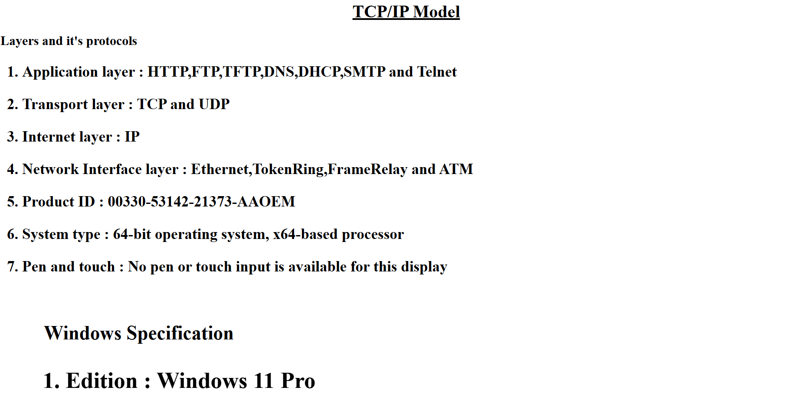
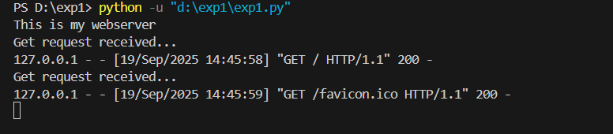

# EX01 Developing a Simple Webserver

# Date:19/09/2025
# AIM:
To develop a simple webserver to serve html pages and display the configuration details of laptop.

# DESIGN STEPS:
## Step 1:
HTML content creation.

## Step 2:
Design of webserver workflow.

## Step 3:
Implementation using Python code.

## Step 4:
Serving the HTML pages.

## Step 5:
Testing the webserver.

# PROGRAM:
```
from http.server import HTTPServer,BaseHTTPRequestHandler
content='''<html>
<head>
<title>Laptop Specification</title>
</head>
<body>
<h1 align='center'><u>TCP/IP Model</u></h1>
<p>
<h2>Layers and it's protocols<h2>
<ol type='1' start='1'>
<h3><li>Application layer : HTTP,FTP,TFTP,DNS,DHCP,SMTP and Telnet</h3></li>
<h3><li>Transport layer : TCP and UDP</h3></li>
<h3><li>Internet layer : IP</h3></li>
<h3><li>Network Interface layer : Ethernet,TokenRing,FrameRelay and ATM</h3></li>
<h3><li>Product ID : 00330-53142-21373-AAOEM</h3></li>
<h3><li>System type : 64-bit operating system, x64-based processor</h3></li>
<h3><li>Pen and touch : No pen or touch input is available for this display</h3></li>
<ol><br>
<h2>Windows Specification<h2>
<ol type='1' start='1'>
<h3><li>Edition : Windows 11 Pro</h3></li>
<h3><li>Version : 24H2</h3></li>
<h3><li>Installed on : 11/09/2025</h3></li>
<h3><li>Os build : 26100.6584</h3></li>
<h3><li>Experience : Windows Feature Experience Pack 1000.26100.234.0</h3></li>
<ol>
</body>
</html>'''
class MyServer(BaseHTTPRequestHandler):
    def do_GET(self):
        print("Get request received...")
        self.send_response(200)
        self.send_header("content-type","text/html")
        self.end_headers()
        self.wfile.write(content,encode())
print("This is my webserver")
server_address=(' ',8000)
httpd =HTTPServer(server_address,MyServer)
httpd.serve_forever()
```
# OUTPUT:


# RESULT:
The program for implementing simple webserver is executed successfully.
